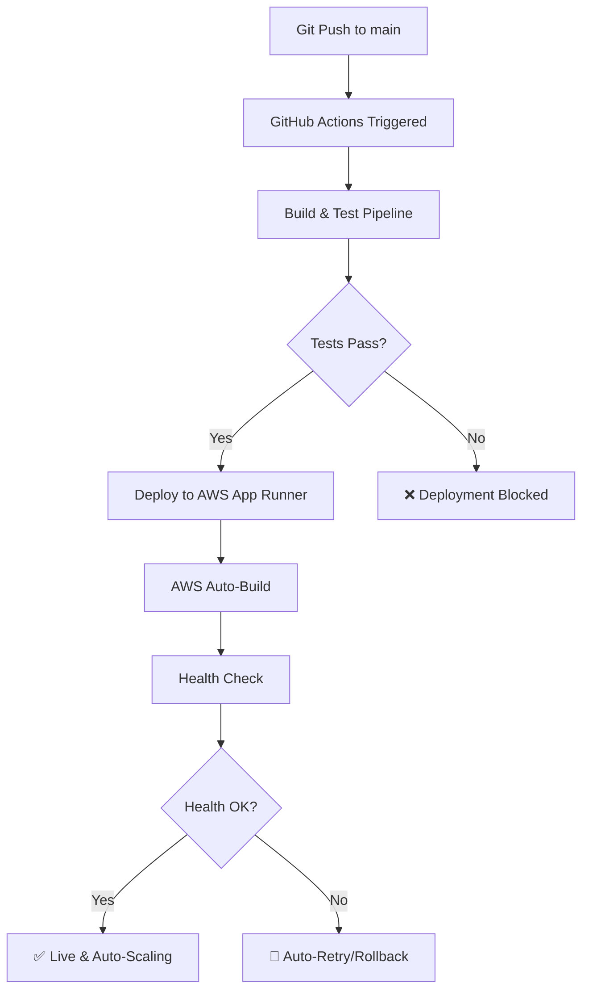

# 🚀 Valifi Auto-Deployment Guide

Complete automation setup for **auto-build**, **auto-deploy**, and **auto-run** on AWS.

## 🎯 What This Achieves

- ✅ **Auto-Build**: Every git push triggers automated build and testing
- ✅ **Auto-Deploy**: Successful builds automatically deploy to AWS App Runner
- ✅ **Auto-Run**: Application automatically starts and scales on AWS
- ✅ **Health Monitoring**: Continuous health checks and auto-recovery
- ✅ **Zero-Downtime**: Rolling deployments with no service interruption

## 🔧 Setup Instructions

### 1. Prerequisites

Before running auto-deployment, ensure you have:

- ✅ AWS CLI installed and configured (`aws configure`)
- ✅ GitHub repository with push access
- ✅ AWS account with App Runner permissions

### 2. Quick Start (Windows)

**Option A: One-Click Deployment**
```batch
# Double-click this file to auto-deploy:
AUTO-DEPLOY-AWS.bat
```

**Option B: Command Line**
```batch
# Run from project directory:
cd C:\Users\josh\Desktop\GodBrainAI\valifi
AUTO-DEPLOY-AWS.bat
```

### 3. Manual Deployment (Linux/Mac)

```bash
# Make script executable
chmod +x scripts/auto-deploy-aws.sh

# Run deployment
./scripts/auto-deploy-aws.sh
```

## 📋 Automation Features

### GitHub Actions Workflow
File: `.github/workflows/aws-deploy.yml`

**Triggers:**
- ✅ Push to `main` branch
- ✅ Pull requests to `main`
- ✅ Manual trigger via GitHub Actions

**Pipeline Steps:**
1. **Build & Test** (Node.js + Bun)
2. **Type Check** (TypeScript)
3. **Lint Code** (ESLint)
4. **Deploy to AWS** (App Runner)
5. **Health Check** (API validation)

### AWS App Runner Configuration
File: `apprunner.yaml`

**Auto-Build Pipeline:**
```yaml
🚀 Auto-Build Steps:
  1. Environment Setup (Node.js 20)
  2. Dependency Installation (npm)
  3. Application Build (Vite)
  4. Post-Build Validation
  5. Health Check Configuration
```

**Auto-Scaling:**
- Min Instances: 1
- Max Instances: 10
- CPU: 0.25 vCPU
- Memory: 0.5 GB

### Health Monitoring
**Health Check Endpoint:** `/api/health`

**Response Example:**
```json
{
  "status": "healthy",
  "runtime": "Bun 1.2.22",
  "timestamp": "2025-01-20T12:00:00.000Z",
  "database": {
    "status": "healthy",
    "connected": true,
    "latency": 45,
    "host": "valifi-production-db.c8y4mxfhjklm.us-east-1.rds.amazonaws.com"
  },
  "environment": "production"
}
```

## 🔄 Auto-Deployment Flow



## 🌐 Deployment URLs

After successful deployment:

| Service | URL | Purpose |
|---------|-----|---------|
| **Main App** | `https://{random-id}.us-east-1.awsapprunner.com` | Production application |
| **Health Check** | `https://{random-id}.us-east-1.awsapprunner.com/api/health` | Service monitoring |
| **API Docs** | `https://{random-id}.us-east-1.awsapprunner.com/api` | API endpoints |

## 📊 Environment Configuration

### Required Environment Variables (AWS App Runner)

```bash
# Application
NODE_ENV=production
PORT=8080

# Database (PostgreSQL RDS)
DB_HOST=valifi-production-db.c8y4mxfhjklm.us-east-1.rds.amazonaws.com
DB_PORT=5432
DB_NAME=valifi_production
DB_USER=valifi_admin
DB_PASSWORD=YOUR_RDS_PASSWORD_HERE

# Security
JWT_SECRET=valifi_jwt_production_secret_2025_secure_key_app_runner_rds
CORS_ORIGIN=*

# Connection Pooling
DB_POOL_MAX=20
DB_POOL_MIN=5
```

### GitHub Secrets (for Actions)

Add these secrets in your GitHub repository:

```bash
# Go to: GitHub Repo → Settings → Secrets and Variables → Actions

AWS_ACCESS_KEY_ID=AKIA...
AWS_SECRET_ACCESS_KEY=...
AWS_ACCOUNT_ID=123456789012
```

## 🛠 Troubleshooting

### Common Issues

**1. Build Fails**
```bash
# Check build logs in GitHub Actions
# Usually caused by:
- Missing dependencies
- TypeScript errors
- Linting failures
```

**2. Deployment Fails**
```bash
# Check AWS App Runner logs
# Usually caused by:
- Invalid apprunner.yaml
- Missing AWS permissions
- Resource limits
```

**3. Health Check Fails**
```bash
# Check service status:
curl https://your-app-url.awsapprunner.com/api/health

# Common causes:
- Database connection issues
- Environment variables missing
- Service still starting up
```

### Manual Fixes

**Reset Deployment:**
```bash
# Delete and recreate service
aws apprunner delete-service --service-arn YOUR_SERVICE_ARN
# Then run AUTO-DEPLOY-AWS.bat again
```

**Update Environment Variables:**
```bash
# Via AWS Console: App Runner → Services → valifi-fintech → Configuration
# Or via CLI:
aws apprunner update-service --service-arn YOUR_SERVICE_ARN --source-configuration file://config.json
```

## 📈 Monitoring & Scaling

### Auto-Scaling Rules
- **Scale Up**: CPU > 80% for 2 minutes
- **Scale Down**: CPU < 20% for 5 minutes
- **Max Instances**: 10
- **Response Time**: < 2 seconds target

### Monitoring Dashboards
1. **AWS CloudWatch**: Metrics and logs
2. **GitHub Actions**: Build/deploy history
3. **App Runner Console**: Service health

## 🔒 Security Features

- ✅ **SSL/HTTPS**: Automatic certificate management
- ✅ **Environment Isolation**: Production/development separation
- ✅ **Database Security**: VPC-isolated RDS with SSL
- ✅ **IAM Roles**: Least-privilege access
- ✅ **Secrets Management**: No hardcoded credentials

## 🚀 Next Steps

After successful auto-deployment:

1. **Custom Domain** (Optional)
   ```bash
   # Configure Route 53 + CloudFront
   # Point your domain to App Runner URL
   ```

2. **Database Setup**
   ```bash
   # Run database migrations
   bun run db:setup-rds
   ```

3. **Monitoring Alerts**
   ```bash
   # Set up CloudWatch alarms
   # Configure email/SMS notifications
   ```

4. **Performance Optimization**
   ```bash
   # Enable CloudFront CDN
   # Configure caching strategies
   ```

## 📞 Support

If you encounter issues:

1. Check AWS App Runner logs in AWS Console
2. Review GitHub Actions build logs
3. Verify environment variables are set correctly
4. Ensure RDS database is accessible

---

## 🎉 Success!

Once setup is complete, you'll have:

✅ **Automatic builds** on every git push
✅ **Zero-downtime deployments** to AWS
✅ **Auto-scaling** based on traffic
✅ **Health monitoring** with auto-recovery
✅ **Production-ready** PostgreSQL database

**Your Valifi application will be live at the generated AWS App Runner URL! 🚀**